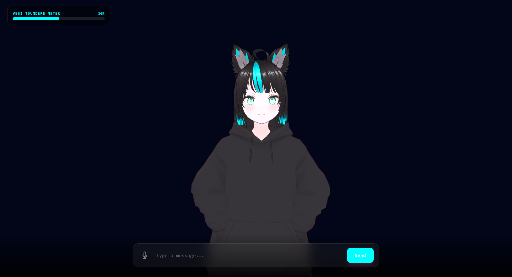

# :ocean: Project Vesi
Vesi is what happens when you give an anime personality a high-performance brain and vocal cords. It's a fully local, multimodal AI agent that can hear you, think for itself, remember conversations, and talk back **all without ever touching the cloud or relying on external APIs.**

Built with Three.js, VRM, and Python. Tested on Python 3.11.14 and Windows > 10.

## :rocket: Features

* :brain: **Local Brain**: Powered by `Llama` models. No API keys or subscriptions.
* :ear: **Sharp Ears**: Uses `Faster-Whisper` to transcribe your voice. Fast and works well even for rally-english.
* :anger: **Memory & Attitude**: Easily configurable personality and remembers conversation history. Mood system tracks emotional state.
* :speech_balloon: **Clear Voice**: Uses `Kokoro-82M` for loud and clear human-like speech with lip sync.
* :microphone: **Push-to-Talk**: Hold the mic button to speak, release to auto-send. Seamless voice interaction.
* :art: **3D Avatar**: Interactive VRM character with natural idle animations, breathing, and blinking.
* :loop: **Hybrid Input**: Switch between speaking and keyboard on the fly.

## :hammer: Tech Stack

### Backend
* Python 3.11
* FastAPI (REST API)
* Llama-cpp-python (The Brains)
* Faster-Whisper (The Hearing)
* Kokoro-ONNX (The Vocal Cords)

### Frontend
* Three.js (3D Rendering)
* @pixiv/three-vrm (VRM Character Support)
* Tailwind CSS (UI Styling)
* Web Audio API (Lip Sync & Audio Playback)

## :camera: Showcase

**DEMO VIDEO LIVE**

* https://www.youtube.com/watch?v=i9Aj_RLnwOU

## :wrench: Setup

### 1. Clone the repo
```bash
git clone https://github.com/arskqz/project_vesi.git
cd project_vesi
```

### 2. Install Python dependencies

**NOTE:** You might want to use python 3.10 (Do your own research) 
```bash
cd server
pip install -r requirements.txt
```

### 3. Download models
- Place your GGUF model in `models/` (e.g., `ana-v1.gguf`)
- Download Kokoro voices and place in `voices/`
- Place your VRM **1.0** model in `client/models` 

### 4. Run the backend
```bash
python main.py
```

### 5. Run the frontend
```bash
cd ../client
python -m http.server 5500
```

### 6. Open in browser
Navigate to `http://127.0.0.1:5500`


⚠️ Warning: This isn't a "one-click" install. You are going to encounter many errors. **Good luck!**

## :video_game: Usage
* **Type**: Enter text in the input box and click Send
* **Speak**: Press and hold the mic button, speak, then release to auto-send
* **Watch**: Vesi responds with voice, lip sync, and mood changes

## :gear: Configuration
Edit `server/main.py` to customize:
* Model path
* System prompt (personality) and reinforcement prompt (remeber personality)
* Temperature settings
* Mood calculation words based on personality (eg. "Baka" good for tsundere types.)


## 🗺️ TODO

* [ ] Start script 

* [ ] Voice Evolution: Custom voice with Kokoro or something different.

* [ ] More animations: Custom animations and multiple vrm model support.


## :mag_right: Technical Challenges & Solutions

* The VRAM Tightrope: One of the biggest hurdles was managing the memory budget of a high-performance LLM alongside a GPU-intensive TTS. I optimized the system by utilizing **4-bit GGUF quantization** for the Llama model and dynamically offloading specific layers to system RAM, ensuring enough VRAM remained for real-time voice synthesis. With this optimization responses even with voice mode are almost instant.

* Breaking the Dependency Loop: I successfully navigated a "**dependency hell**" scenario where the original TTS library was unmaintained and conflicting with modern Python 3.11 environments. I solved this by surgically patching library imports and pivoting to a community-maintained ONNX-based architecture for better stability and performance. In the future I am Planning to train my own audio model.


## :clap: Credits

Llama for model and training -> https://github.com/ggml-org/llama.cpp

Model used -> https://huggingface.co/TheBloke/Ana-v1-m7-GGUF

STT Faster-Whisper -> https://github.com/SYSTRAN/faster-whisper

TTS Kokoro -> https://github.com/thewh1teagle/kokoro-onnx

Three JS VRM by pixiv -> https://github.com/pixiv/three-vrm

Inspiration for the project and vtube model -> https://www.youtube.com/@JustRayen


## :page_facing_up: License

MIT License - do whatever you want with it.

Go make your own AI Waifu !

Made with love and loads of coffee.