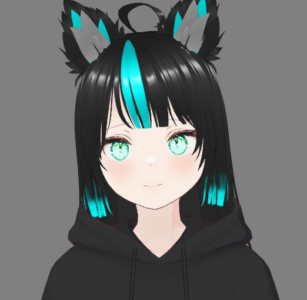

# :ocean: Project Vesi

Vesi is what happens when you give an anime personality high-performance brain and vocal cords. It's a fully local, multimodal AI agent that can hear you, think for itself, remember conversations, and talk back all without ever touching the cloud or relying on external API's. 

Tested on Python 3.11 and Windows > 10.

## :rocket: Features

* :brain: **Local Brain**: Powered by ```LLama``` models. No API keys or subscriptions.

* :ear: **Sharp Ears**: Uses ```Faster-Whisper``` to transcribe your voice. Fast and works well even for rally-english.

* :anger: **Memory & Attitude**: Easily configurable personality and remembers conversation history. 

* :speech_balloon: **Clear voice**: Uses ```Kokoro-82M``` for loud and clear human-like speech.

* :loop: **Hybrid input**: Switch between speaking and keyboard on the fly using threading. 

## :hammer: Tech Stack

* Python 3.11

* Llama-cpp-python (The Brains)

* Faster-Whisper (The Hearing)

* Kokoro-ONNX (The Vocal Cords)

## :camera: Showcase

[DEMO video](https://youtu.be/oGykuE8WtAs "DEMO video")

No front end. But back end about 90 % done. 

I'm gonna do a full video once im happy with the project.


1. Clone this repo.

2. Install Python 3.11. 

3. Install packages: ```pip install -r requirements.txt```

4. GPU boost: If you have an NVIDIA card, grab CUDA 12.4 - 12.6 and FFmpeg. To enable GPU acceleration.

5. Run main.py: ```python main.py```

⚠️ Warning: This isn't a "one-click" install. You are going to encounter many errors. Good luck


## 🗺️ TODO

* 🎙️ Voice Evolution: Custom voice with Kokoro or somethind different.

* 🌐 Web UI: Moving out of the terminal and into a sleek browser interface.


## :mag_right: Technical Challenges & Solutions

* The VRAM Tightrope: One of the biggest hurdles was managing the memory budget of a high-performance LLM alongside a GPU-intensive TTS. I optimized the system by utilizing **4-bit GGUF quantization** for the Llama model and dynamically offloading specific layers to system RAM, ensuring enough VRAM remained for real-time voice synthesis. With this optimization responses even with voice mode are almost instant.

* Breaking the Dependency Loop: I successfully navigated a "**dependency hell**" scenario where the original TTS library was unmaintained and conflicting with modern Python 3.11 environments. I solved this by surgically patching library imports and pivoting to a community-maintained ONNX-based architecture for better stability and performance. In the future I am Planning to train my own audio model.


## :clap: Credits

Llama for model and training -> https://github.com/ggml-org/llama.cpp

Model used -> https://huggingface.co/TheBloke/Ana-v1-m7-GGUF

STT Faster-Whisper -> https://github.com/SYSTRAN/faster-whisper

TTS Kokoro -> https://github.com/thewh1teagle/kokoro-onnx

Inspiration for the project and vtube model -> https://www.youtube.com/@JustRayen


## License

MIT license. 

Permission is hereby granted, free of charge, to any person obtaining a copy of this software and associated documentation files (the “Software”), to deal in the Software without restriction, including without limitation the rights to use, copy, modify, merge, publish, distribute, sublicense, and/or sell copies of the Software, and to permit persons to whom the Software is furnished to do so, subject to the following conditions:

The above copyright notice and this permission notice shall be included in all copies or substantial portions of the Software.

THE SOFTWARE IS PROVIDED “AS IS”, WITHOUT WARRANTY OF ANY KIND, EXPRESS OR IMPLIED, INCLUDING BUT NOT LIMITED TO THE WARRANTIES OF MERCHANTABILITY, FITNESS FOR A PARTICULAR PURPOSE AND NONINFRINGEMENT. IN NO EVENT SHALL THE AUTHORS OR COPYRIGHT HOLDERS BE LIABLE FOR ANY CLAIM, DAMAGES OR OTHER LIABILITY, WHETHER IN AN ACTION OF CONTRACT, TORT OR OTHERWISE, ARISING FROM, OUT OF OR IN CONNECTION WITH THE SOFTWARE OR THE USE OR OTHER DEALINGS IN THE SOFTWARE.
