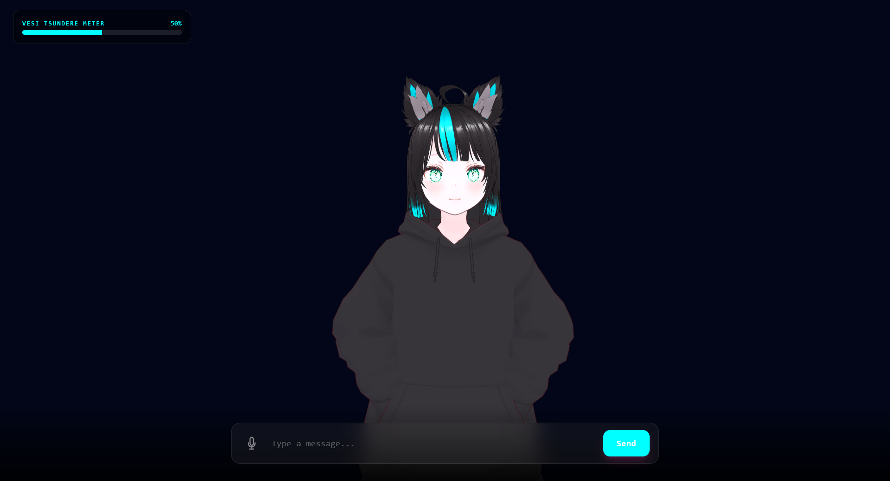

# :ocean: Project Vesi
Vesi is what happens when you give an anime personality a high-performance brain and vocal cords. It's a fully local, multimodal AI agent that can hear you, think for itself, remember conversations, and talk back **all without ever touching the cloud or relying on external APIs.**

Built with Three.js, VRM, and Python. Tested on Python 3.11.14 and Windows > 10.

## :rocket: Features

* :brain: **Local Brain**: Powered by a custom fine-tuned `Llama 3` model. No API keys or subscriptions.
* :ear: **Sharp Ears**: Uses `Faster-Whisper` to transcribe your voice. Fast and works well even for rally-english.
* :anger: **Mood System**: Bidirectional "dere meter" (0–100) that scans both Vesi's responses and user input for emotional keywords. Drives LLM temperature, TTS speech speed, and frontend mood bar in real time.
* :floppy_disk: **Memory Compression**: Long-term memory via LLM-powered summarization. Old conversation turns are compressed into narrative blocks in Vesi's voice, keeping recent context hot.
* :speech_balloon: **Clear Voice**: Uses `Kokoro-82M` for loud and clear human-like speech with lip sync.
* :microphone: **Push-to-Talk**: Hold the mic button to speak, release to auto-send. Seamless voice interaction.
* :art: **3D Avatar**: Interactive VRM character with natural idle animations, breathing, and blinking.
* :loop: **Hybrid Input**: Switch between speaking and keyboard on the fly.
* :wrench: **Tool System** *(Experimental)*: Context injection layer before LLM calls. Passive tools (datetime) always run; active tools trigger on user input keywords. Easily extensible.
* :memo: **Live Config**: Personality and user facts defined in `vesi_config.yaml`. Add facts at runtime via the `/remember` endpoint. No restart needed.

## :hammer: Tech Stack

### Backend
* Python 3.11
* FastAPI (REST API)
* Llama-cpp-python (The Brains)
* Faster-Whisper (The Hearing)
* Kokoro-ONNX (The Vocal Cords)

### Frontend
* Three.js (3D Rendering)
* @pixiv/three-vrm (VRM Character Support)
* Tailwind CSS (UI Styling)
* Web Audio API (Lip Sync & Audio Playback)

## :camera: Showcase

**DEMO VIDEO LIVE**

* https://www.youtube.com/watch?v=i9Aj_RLnwOU

## :brain: Custom Fine-Tuned Model

Vesi runs on a **custom fine-tuned Llama 3 8B model**, trained using [Unsloth](https://github.com/unslothai/unsloth) with LoRA on a hand-crafted conversational dataset (~400 examples). The model is quantized to Q6_K GGUF for efficient local inference.

The full dataset contains personal information and won't be shared, but a cleaned public version (~300 conversations) 
is available on HuggingFace: [Tsundere-AI Dataset](https://huggingface.co/datasets/arskaz/Tsundere-AI). 
It's a good starting point for training your own character AI with minimal tweaking.

However, the full training pipeline is documented in [`training/training.ipynb`](training/training.ipynb). Feel free to use it as a reference to fine-tune your own model with your own data.

If you are interested in training your own model check out:

- [Unsloth Documentation](https://docs.unsloth.ai)
- [Hugging Face Documentation](https://huggingface.co/docs)
- [llama.cpp](https://github.com/ggerganov/llama.cpp)


## :wrench: Setup

### 1. Clone the repo
```bash
git clone https://github.com/arskqz/project_vesi.git
cd project_vesi
```

### 2. Install Python dependencies

**NOTE:** You might want to use python 3.10 (Do your own research) 
```bash
cd server
pip install -r requirements.txt
```

### 3. Download models
- Place your GGUF model in `models/` (e.g., `ana-v1.gguf` or `lumimaid-v2.gguf`) It is also important to choose the right quantization for your GPU.
- Download Kokoro voices and place in `voices/`
- Place your VRM **1.0** model in `client/models` 

### 4. Add your own prompt
- Add your own prompt to `vesi_config.example.yaml`
- Change the file name to `vesi_config.yaml`
- Feel free to play around with the mood system and change it to your liking. 

### 5. Download three.js
- Download three.js, three VRM and Tailwind css using `npm`, `vite` or something else.

### 6. Run start script 
- Edit your conda path and environment name.
- run `start.bat`.

I'll add bash one soon... 

⚠️ Warning: This isn't a "one-click" install. You are going to encounter many errors. **Good luck!**

## :video_game: Usage
* **Type**: Enter text in the input box and click Send
* **Speak**: Press and hold the mic button, speak, then release to auto-send
* **Watch**: Vesi responds with voice, lip sync, and mood changes

## :gear: Configuration

**Personality** — Edit `server/vesi_config.yaml`:
* `system_prompt` — Vesi's full personality prompt
* `user_facts` — List of facts about the user, injected into the system prompt. Can also be added at runtime via the `/remember` API endpoint.

**Model & Inference** — Edit `server/main.py`:
* `MODEL_PATH` — Path to your `.gguf` model file
* `n_gpu_layers` — GPU/CPU layer offloading (tune for your VRAM)

**Mood System** — Edit `server/mood_system.py`:
* Tsun/dere keyword lists for Vesi's responses and user input
* Score-to-temperature and score-to-TTS-speed mappings

**Tools** — Edit `server/tools.py`:
* Add passive tools (always injected) or active tools (keyword-triggered) to extend Vesi's context awareness


## 🗺️ TODO

* [ ] More animations: Custom animations and multiple vrm model support.

* [ ] Voice Evolution: Custom voice with Kokoro or something different.

* [ ] Start script: If someone pesters me enough I'll do it. 


## :mag_right: Technical Challenges & Solutions

* **The VRAM Tightrope:** One of the biggest hurdles was managing the memory budget of a high-performance LLM alongside a GPU-intensive TTS. I optimized the system by utilizing **6-bit GGUF quantization** for the Llama model and dynamically offloading specific layers to system RAM, ensuring enough VRAM remained for real-time voice synthesis. With this optimization responses even with voice mode are almost instant.

* **Breaking the Dependency Loop:** I successfully navigated a "**dependency hell**" scenario where the original TTS library was unmaintained and conflicting with modern Python 3.11 environments. I solved this by surgically patching library imports and pivoting to a community-maintained ONNX-based architecture for better stability and performance.

* **Fine-Tuning a Personality:** Training a model to feel like a real character — not a generic chatbot — required careful dataset engineering. With only ~400 hand-crafted examples, the margin between a flat personality and heavy overfitting was razor-thin. I iterated on LoRA rank, epoch count, and dataset balance to land on a model that captures Vesi's tsundere voice without parroting the training data.

## 🤖 State of Development

This is an actively developed personal project. Expect rough edges and experimental features. It is built for learning and fun, not production use.

Parts of this project were developed with **agent-assisted programming** using [Claude Code](https://docs.anthropic.com/en/docs/claude-code), as an experiment in AI-augmented development workflows. From testing Anthropic does not have much training data for on AI waifus.

## :clap: Credits

Llama for model and training -> https://github.com/ggml-org/llama.cpp

Model used -> https://huggingface.co/Lewdiculous/Llama-3-Lumimaid-8B-v0.1-OAS-GGUF-IQ-Imatrix

STT Faster-Whisper -> https://github.com/SYSTRAN/faster-whisper

TTS Kokoro -> https://github.com/thewh1teagle/kokoro-onnx

Three JS VRM by pixiv -> https://github.com/pixiv/three-vrm

Inspiration for the project and vtube model -> https://www.youtube.com/@JustRayen


## :page_facing_up: License

MIT License - do whatever you want with it.

Go make your own AI Waifu !

Made with love and loads of coffee.